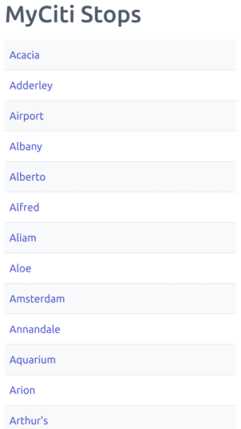
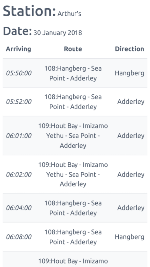

# Where Is the Express

http://whereisthemyciti.com

Born out of the desire for a mobile-friendly version of the Cape Town MyCiti bus-top website.

**Current Web-Site**

**Version A**

## How-To Run

Run the Flask server using the `./run.sh` script.

### scrape.py

`scrape.py` should run every few days to scrape the bus-stop stations and IDs. Bus-stops are unlikely to change and new bus-stops should be infrequent

